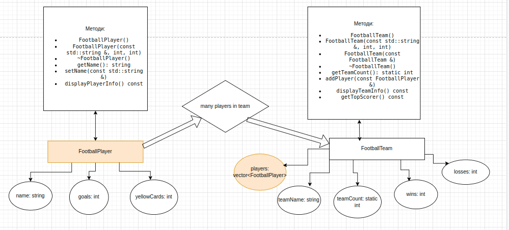

# Лабораторна робота №3: ООП

# Студента групи КІ2С-23-1 Рудичука Дмитра 
# Варіант завдання №4

## Повний звіт виконання лабораторної роботи знаходиться в директорії "documents"

## Тема
Конструктори та деструктори, статичні фукнкції та елементи данних, дружні функції та класи, конструктор копіювання в С++

## Мета
- Вивчити особливості побудови та використання конструкторів та деструкторів
- Навчитися розробляти статичні функції, дружні фукнкції та класи
- Вивчити конструктор копіювання в С++


## Структура програми
Програма складається з трьох основних файлів:
- `main.cpp` — містить основну логіку програми.
- `team.h` — визначення класів `FootballPlayer` і `FootballTeam`.
- `team.cpp` — реалізація класів `FootballPlayer` і `FootballTeam`.


### Функціонал
- Програма реалізує функціонал для ведення статистики футбольних команд та їх гравців.
- Додано можливість створення, копіювання та знищення об'єктів класів.
- Реалізовано статичні елементи класів для відстеження кількості гравців і команд.
- Використовуються дружні функції для доступу до приватних полів класів.

# Діаграма


Файл із діаграмою знаходиться у директорії "images"

## Виконання програми
1. Клонувати репозиторій:
   ```bash
   git clone https://github.com/RudychukDmytro/OOP_Labs_3
2. Перейти відкрити в термінальному вікні робочий каталог
3. Виконати компіляцію:
   ```bash
   g++ main.cpp students.cpp trains.cpp -o program
4. Запустити скомпільований файл:
   ```bash
   ./program

Приклад для запуску програми наведено для операційної системи Ubuntu або їй подібним.

## Висновки
У процесі виконання лабораторної роботи було досягнуто таких результатів:

1. Ознайомлення з конструкторами та дестекторами: Вивчені особливості використання конструкторів (за замовчуванням, з параметрами та копіювання) і деструкторів для управління життєвим циклом об'єктів.
2. Статичні елементи класів: Реалізовано статичні поля для відстеження кількості гравців і команд, що забезпечує загальний облік.
3. Дружні функції: Розроблено дружні функції, що дозволяють доступ до приватних елементів класу, покращуючи інкапсуляцію даних.
4. Копіювання об'єктів: Запроваджено конструктор копіювання для забезпечення правильного копіювання об'єктів класу.
5. Структура програми: Створена чітка структура програми з окремими файлами для реалізації основної логіки та класів.

Всі функціональні вимоги були виконані, програма демонструє коректну роботу та виконує поставлені задачі.
